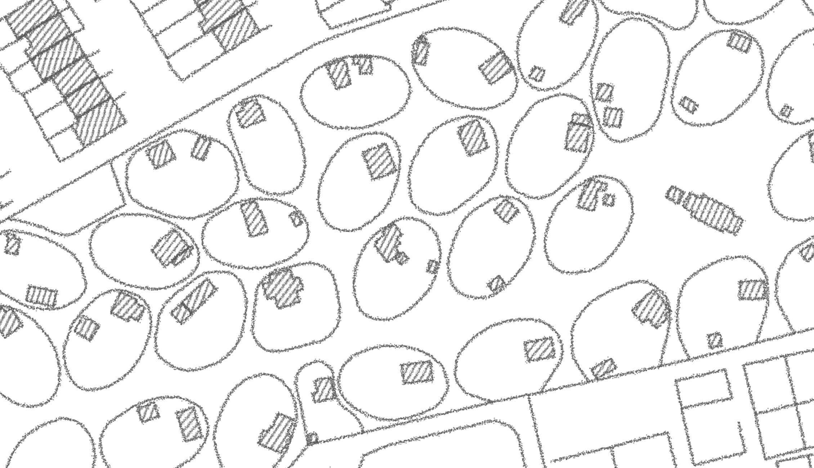
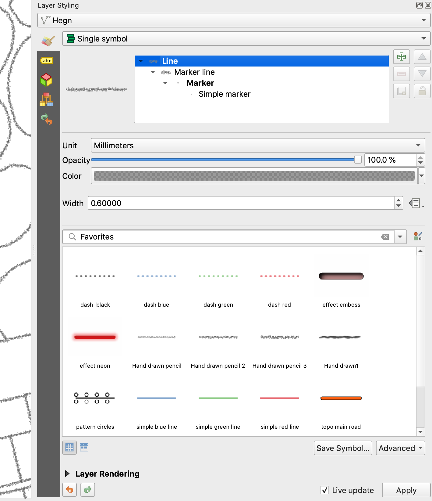
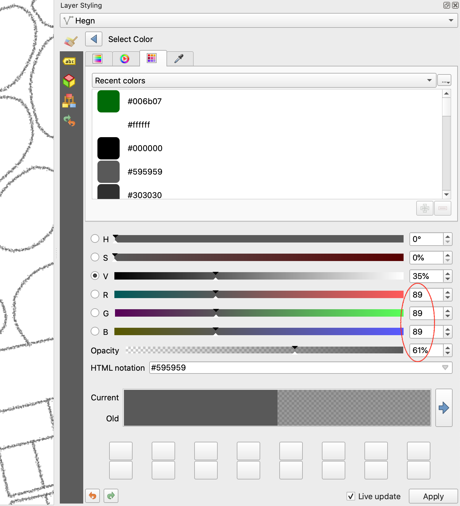
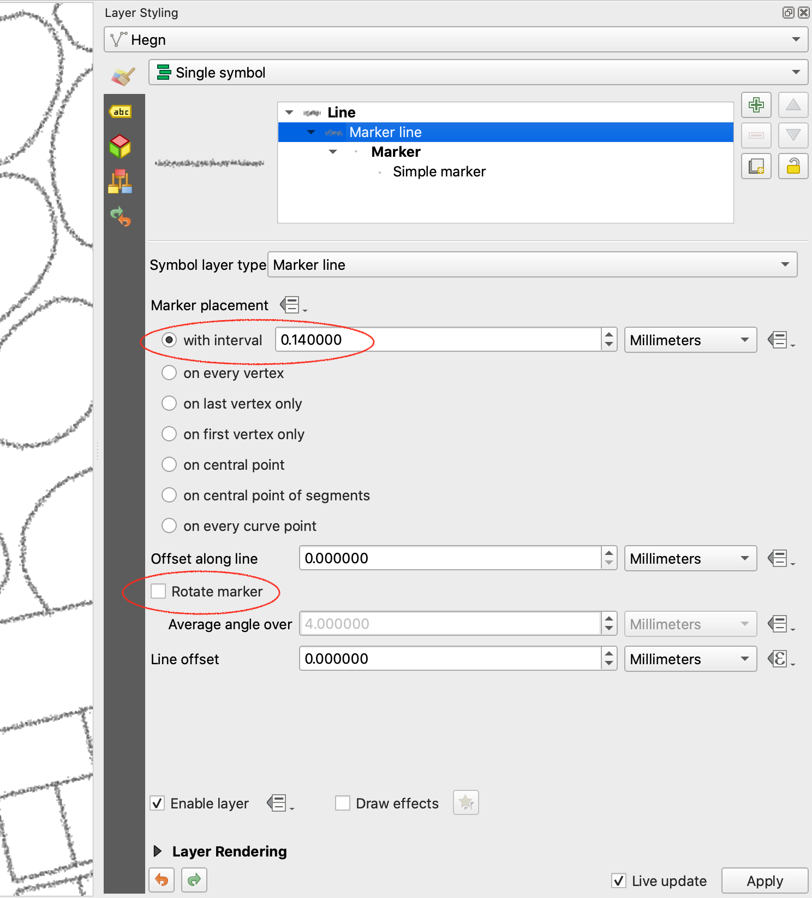
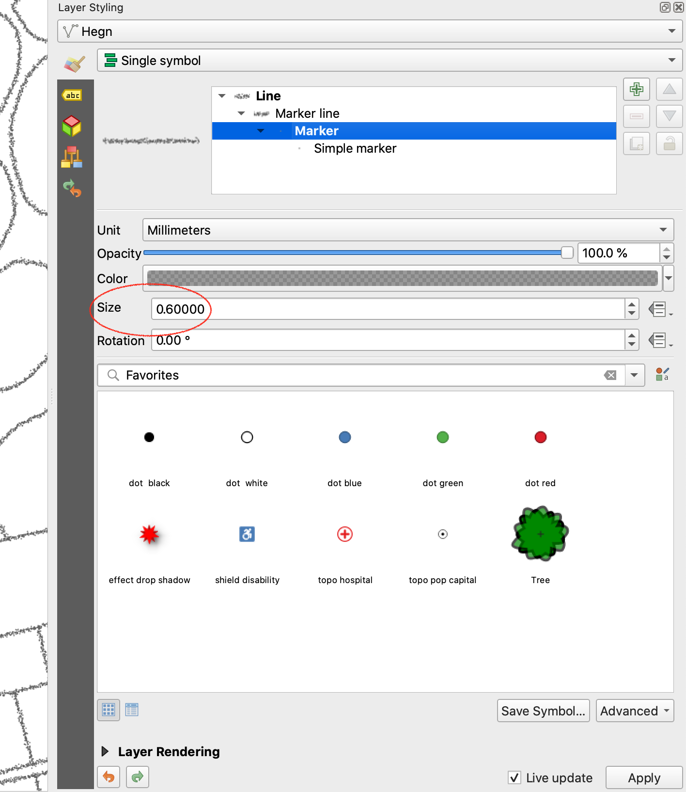
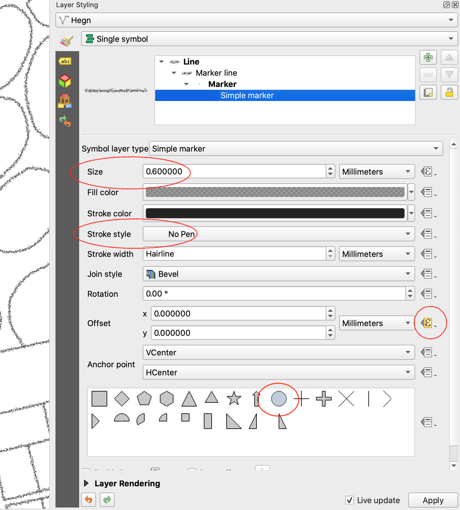
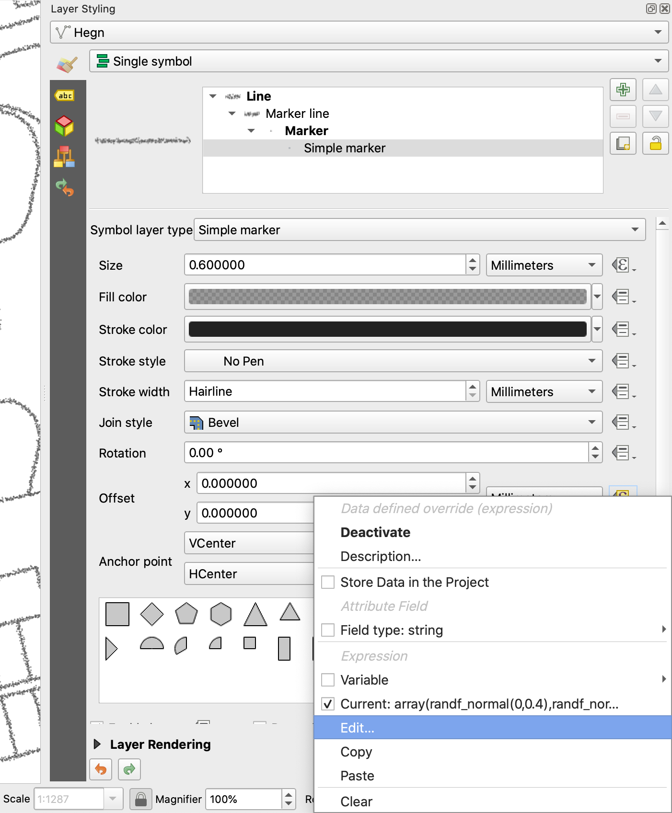
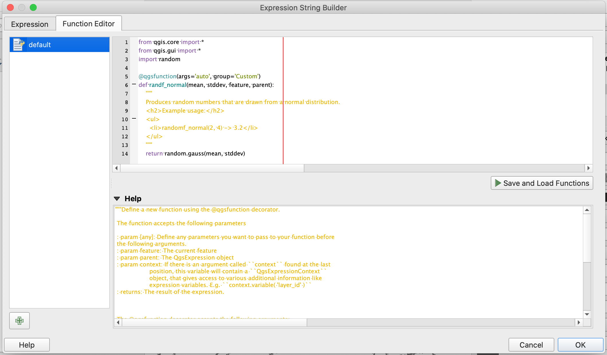
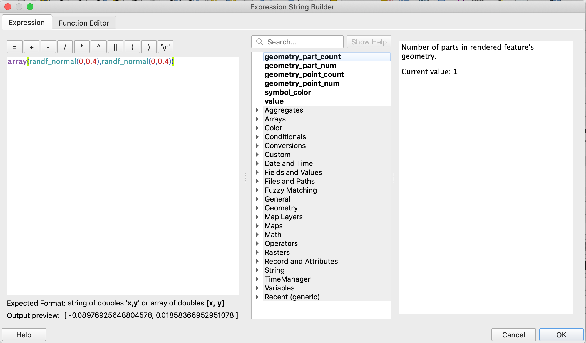

# QGIS pencil styles



The file [pencil_styles.xml](pencil_styles.xml) contains three pencil like line styles for QGIS: ,  and .

Install by opening the `Style Manager` and clicking `Import`. Then import this URL `https://github.com/AsgerPetersen/qgis_styles/pencil_styles/pencil_styles.xml`.

See the [QGIS docs](https://github.com/StephSaephan/QGIS-ESRI-Converted-Styles/raw/master/XML/Forestry.xml) for a description of how to use the Style Manager.

## Prerequisite
The pencil styles all use a custom python function, which must be present in your QGIS.

```python
from qgis.core import *
from qgis.gui import *
import random

@qgsfunction(args='auto', group='Custom')
def randf_normal(mean, stddev, feature, parent):
    """
    Produces random numbers that are drawn from a normal distribution.
    <h2>Example usage:</h2>
    <ul>
      <li>randomf_normal(2, 4) -> 3.2</li>
    </ul>
    """
    return random.gauss(mean, stddev)
```
See below screenshots for how to enable this function in your QGIS.

## Methodology















